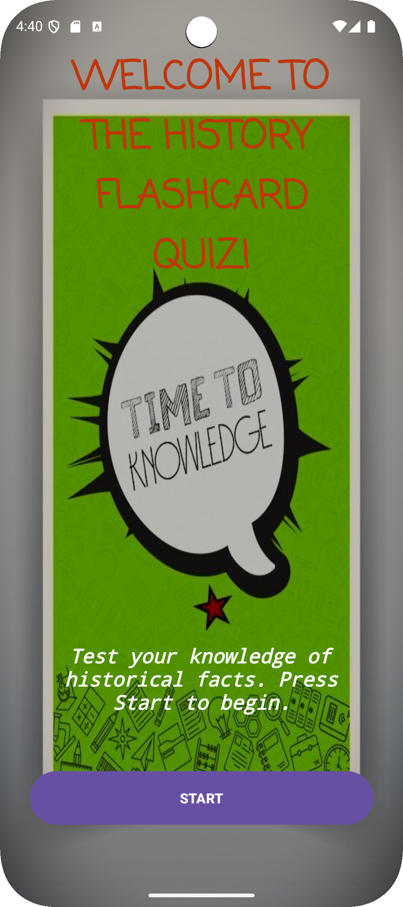
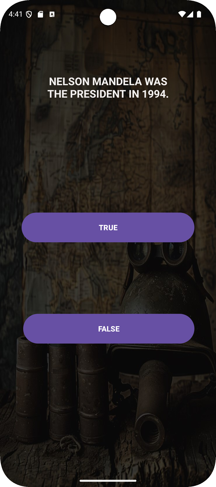
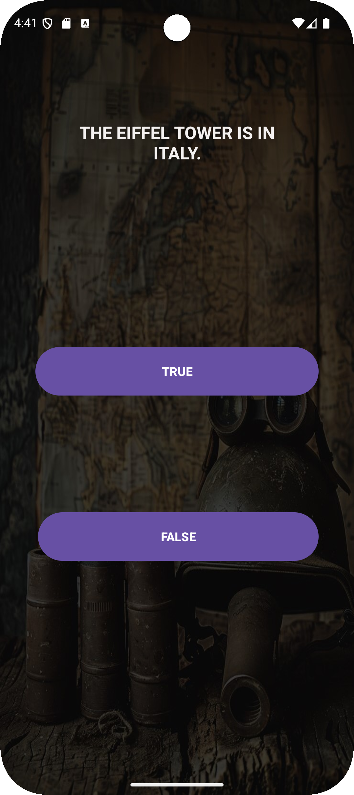
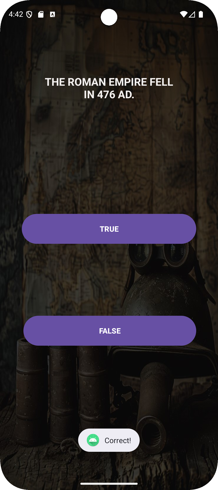
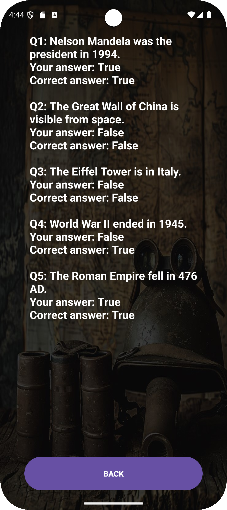

# 2025PROJECT2
# History Flashcard Quiz App

This is a simple Android Quiz App designed to test users' knowledge on various topics. It consists of four main activities: `MainActivity`, `QuestionActivity`, `ScoreActivity`, and `ReviewActivity`. Below is a detailed explanation of what each activity does and the functionality of the code:
friendly UI
cool and funny to use
enjoy!

## MainActivity
The `MainActivity` serves as the welcome screen of the app.

### Key Features:
1. **Welcome Screen**: Displays a welcome message and a "Start" button.
2. **Navigation**: Clicking the "Start" button transitions the user to the `QuestionActivity`.

### Code Walkthrough:
- **`onCreate` Method**:
    - Sets up the layout using `setContentView`.
    - Logs the app launch using `Log.d`.
    - Finds the "Start" button using `findViewById` and sets up a click listener.
    - On button click, an `Intent` is used to navigate to the `QuestionActivity`.

## QuestionActivity
The `QuestionActivity` handles the main quiz logic, where users answer true/false questions.

### Key Features:
1. **Questions and Answers**:
    - Displays a series of questions.
    - Stores correct answers in a `booleanArray`.
2. **User Interaction**:
    - Users can click "True" or "False" to answer a question.
    - Validates their answers and provides instant feedback (correct/incorrect).
3. **Score Calculation**:
    - Tracks the user's score and stores their responses.
4. **Quiz Completion**:
    - Ends the quiz and navigates to the `ScoreActivity`.

### Code Walkthrough:
- **`questions` and `answers`**:
    - Parallel arrays store the questions and their correct answers.
- **User Interaction**:
    - Button click listeners for "True" and "False" store the user's response and validate it using the `checkAnswer` method.
    - If all questions are answered, the `endQuiz` method navigates to the `ScoreActivity`.
- **`checkAnswer` Method**:
    - Checks if the user's answer matches the correct answer.
    - Displays a toast message ("Correct!" or "Incorrect!") based on the result.
- **`endQuiz` Method**:
    - Prepares an `Intent` to pass the user's score, answers, and questions to the `ScoreActivity`.

## ScoreActivity
The `ScoreActivity` displays the user's final score and provides options to review their answers or exit the app.

### Key Features:
1. **Score Display**:
    - Shows the user's score out of the total number of questions.
2. **Feedback**:
    - Provides personalized feedback based on the score.
3. **Navigation**:
    - Users can review their answers or exit the app.

### Code Walkthrough:
- **`onCreate` Method**:
    - Retrieves the score, user's answers, and correct answers from the previous activity using `Intent`.
    - Displays the score and feedback message.
- **Buttons**:
    - **Review Button**: Navigates to the `ReviewActivity` to show a detailed review of the user's answers.
    - **Exit Button**: Exits the app using `finishAffinity`.

## ReviewActivity
The `ReviewActivity` displays all the quiz questions along with the user's answers and the correct answers.

### Key Features:
1. **Detailed Review**:
    - Lists all questions with the user's responses and correct answers.
2. **Navigation**:
    - Allows users to return to the previous screen.

### Code Walkthrough:
- **`onCreate` Method**:
    - Retrieves the questions, user's answers, and correct answers from the `Intent`.
    - Builds a detailed review of all questions and answers.
    - Displays the review content in a `TextView`.
- **Back Button**:
    - Allows the user to return to the `ScoreActivity`.

## Code Highlights:
1. **Logging**:
    - Each activity uses `Log.d` for debugging and tracking user flow.
2. **Intuitive Navigation**:
    - `Intent` is used to transition between activities and pass data seamlessly.
3. **User Feedback**:
    - Provides instant feedback for each question and a detailed review at the end.
4. **Robust Data Handling**:
    - Ensures safe handling of user responses and correct answers through validation and default values.

## How to Run:
1. Clone the repository.
2. Open the project in Android Studio.
3. Build and run the app on an emulator or a physical Android device.

## Future Enhancements:
Developpers can add more questions and support for multiple categories.
Implement a timer for each question.
Customize UI with animations and themes.
Save user progress and scores using a database.

With this detailed explanation of the app and its code, developers and users can understand how the app works and extend its functionality as needed.

##  Screenshots
welcome screen

question activity 

score activity

review activity

## ST Info:

Std Name : Jean Baptiste Mwana /

Std number: ST10492515.

HMAW - Higher Certificate in mobile application and Web development module :IMAD5111(Assignment2)./2025RC

My repository link: https://github.com/Jeankaneki/2025PROJECT2.git

My youtube video link: https://www.youtube.com/watch?v=hbGMFaKezrY

Thanks!
